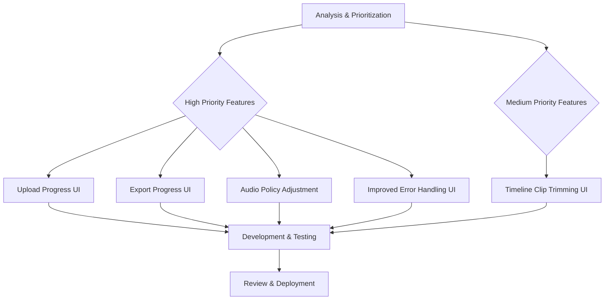

# Feature Implementation Plan

## Current Feature Status & Recommendations

Based on the recent comprehensive analysis, the core application features are largely implemented and stable. This document outlines the plan to address identified gaps and enhance user experience.

### Implemented Core Features:
- **File Upload**: Basic functionality for video file ingestion.
- **Timeline Editing**: Core ability to arrange and manipulate video clips on a timeline.
- **Speed Control**: Functionality to adjust playback speed of individual clips.
- [x] **Video Preview**: Real-time preview of the edited video.
- [x] **Video Preview Playback**: Full playback functionality including play/pause and scrubbing.
- **Persistence**: Project data saved and loaded (IndexedDB & localStorage).

### Notes on Implemented Features:

#### Video Preview:
- **Current Status**: The video preview playback feature, including play button functionality, is fully implemented and operational.
- **Implementation Details**:
    - **Web Worker for Decoding & Rendering**: Frame decoding and rendering are efficiently offloaded to a Web Worker (`src/utils/videoWorker.ts`), ensuring the main UI thread remains responsive. This utilizes `OffscreenCanvas` for rendering frames without direct DOM access from the worker.
    - **Playback Loop & Frame Timing**: A precise playback loop manages frame timing, ensuring smooth video playback. It calculates the time to display each subsequent frame based on the video's FPS and current playback speed.
    - **Play/Pause and Scrubbing Handling**: The implementation fully supports play/pause functionality, allowing users to control playback. Scrubbing is also handled, enabling users to jump to any point in the video timeline, with the Web Worker efficiently seeking and rendering the appropriate frame.
- **Limitations & Considerations**:
    - Speed adjustments currently require full video re-encoding, which can be computationally intensive. Future enhancements might explore more optimized approaches.
    - The FFmpeg.wasm initialization uses top-level await and runs with `concurrency=1` to prevent race conditions during processing.
    - Thumbnail generation is a blocking operation but is cached in IndexedDB to mitigate performance impact after the initial generation.
    - Memory limits within the browser's IndexedDB quotas and FFmpeg.wasm memory usage are ongoing considerations for large projects.
- **Future Enhancements**: Potential improvements include optimizing speed change processing, further enhancing performance for large video assets, exploring advanced preview capabilities, and implementing frame-by-frame navigation.

### Identified Gaps & Priorities:
The following areas require immediate attention to improve user experience and align with product requirements:

#### High Priority:
1.  **Enhanced User Feedback for Long Operations**:
    *   **Upload Progress UI**: Provide clear visual feedback and progress indicators during video file uploads.
    *   **Export Progress UI**: Implement a detailed progress display during video export, including estimated time and current step.
2.  **Audio Policy Alignment**:
    *   **Strip Audio by Default**: Modify the system to automatically strip audio from uploaded videos unless explicitly configured otherwise, aligning with the Product Requirements Document (PRD).
3.  **Comprehensive Error Guidance and UI**:
    *   Improve error messaging and provide actionable guidance to users when issues arise during upload, processing, or export.

#### Medium Priority:
1.  **Timeline Clip Trimming UI**:
    *   Develop a user interface for precisely trimming the start and end points of video clips directly on the timeline. (Schema support already exists, UI implementation is pending).

## Implementation Workflow

## Detailed Implementation Steps

### High Priority Tasks:

1.  **Upload Progress UI**:
    *   **Task**: Implement progress indicators and visual feedback for file uploads in the `UploadArea.tsx`.
    *   **Components Affected**: [`UploadArea.tsx`](src/components/editor/UploadArea.tsx), [`useFileUpload.ts`](src/hooks/useFileUpload.ts).
    *   **Acceptance Criteria**: Users can see the progress of each file upload, including percentage and estimated time.

2.  **Export Progress UI**:
    *   **Task**: Develop a detailed progress modal or section for video export operations.
    *   **Components Affected**: [`ExportModal.tsx`](src/components/editor/ExportModal.tsx), [`videoProcessor.ts`](src/utils/videoProcessor.ts).
    *   **Acceptance Criteria**: Users receive real-time updates on export status, including current processing stage and a progress bar.

3.  **Audio Policy Adjustment (Strip Audio by Default)**:
    *   **Task**: Modify video processing logic to automatically remove audio during ingestion/processing unless specified.
    *   **Components Affected**: [`videoProcessor.ts`](src/utils/videoProcessor.ts), [`VideoFile.ts`](src/types/schema/VideoFile.ts).
    *   **Acceptance Criteria**: Newly uploaded videos have their audio stripped by default. User has an option to retain audio.

4.  **Comprehensive Error Guidance and UI**:
    *   **Task**: Enhance error handling to provide more user-friendly messages and guidance for common issues.
    *   **Components Affected**: [`errorHandling.ts`](src/utils/errorHandling.ts), various UI components for displaying errors.
    *   **Acceptance Criteria**: Error messages are clear, concise, and offer steps for resolution.

### Medium Priority Tasks:

1.  **Timeline Clip Trimming UI**:
    *   **Task**: Implement interactive UI elements on the timeline for users to visually adjust clip start and end points.
    *   **Components Affected**: [`Timeline.tsx`](src/components/editor/Timeline.tsx), [`editor.ts`](src/types/editor.ts) (types), [`useEditorState.ts`](src/hooks/useEditorState.ts) (state management).
    *   **Acceptance Criteria**: Users can drag handles on clips in the timeline to trim them, updating the video segment.

## Expected Outcomes

*   Improved user experience through better feedback during long-running operations.
*   Alignment with PRD for audio handling.
*   More robust and user-friendly error handling.
*   Enhanced editing capabilities with direct timeline trimming.