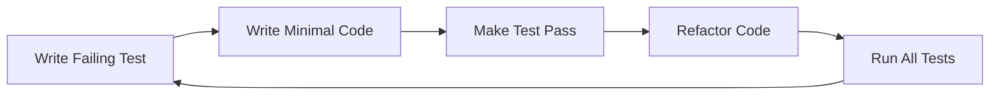
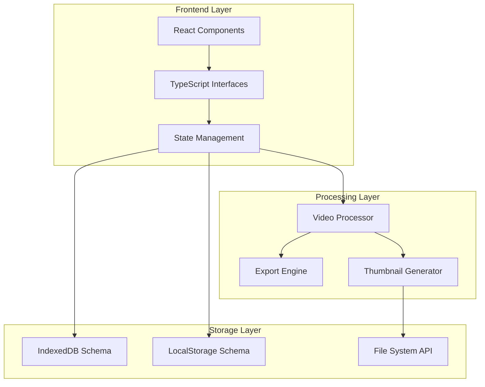
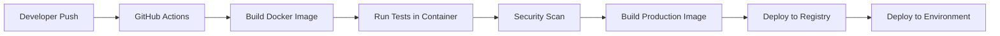

# Implementation Plan: Timelapse Editor

## Executive Summary

This implementation plan provides a comprehensive roadmap for developing the browser-based timelapse video editor, incorporating Test-Driven Development (TDD), consistent data schema management, CI/CD with Docker, and a clear first milestone for local build deployment. The plan builds upon the [`SOFTWARE_ARCHITECTURE_PLAN.md`](docs/SOFTWARE_ARCHITECTURE_PLAN.md) and requirements from [`Timelapse_PRD_Gemini v2.md`](docs/Timelapse_PRD_Gemini%20v2.md). Effort estimates are provided using qualitative tokens (S, M, L, XL).

## 1. Test-Driven Development (TDD) Strategy

### 1.1 TDD Philosophy and Integration

The development workflow will follow a strict TDD approach with the **Red-Green-Refactor** cycle integrated into every feature development phase:



### 1.2 Testing Framework Architecture

#### Core Testing Stack
```typescript
// Testing dependencies to be added to package.json
{
  "devDependencies": {
    "@testing-library/react": "^14.1.2",
    "@testing-library/jest-dom": "^6.1.5",
    "@testing-library/user-event": "^14.5.1",
    "vitest": "^1.0.4",
    "jsdom": "^23.0.1",
    "@vitest/ui": "^1.0.4",
    "msw": "^2.0.11",
    "playwright": "^1.40.1",
    "@playwright/test": "^1.40.1"
  }
}
```

#### Testing Configuration
```typescript
// vitest.config.ts
import { defineConfig } from 'vitest/config';
import react from '@vitejs/plugin-react-swc';
import path from 'path';

export default defineConfig({
  plugins: [react()],
  test: {
    globals: true,
    environment: 'jsdom',
    setupFiles: ['./src/test/setup.ts'],
    coverage: {
      reporter: ['text', 'json', 'html'],
      exclude: [
        'node_modules/',
        'src/test/',
        '**/*.d.ts',
        '**/*.config.*'
      ]
    }
  },
  resolve: {
    alias: {
      '@': path.resolve(__dirname, './src'),
    },
  },
});
```

### 1.3 Testing Strategy by Layer

#### 1.3.1 Unit Testing Strategy

**Component Testing**
```typescript
// Example: VideoFile component test structure
describe('VideoFile Component', () => {
  it('should render file metadata correctly', () => {
    // Test file display
  });
  
  it('should handle drag operations', () => {
    // Test drag-and-drop functionality
  });
  
  it('should show upload progress', () => {
    // Test progress indicators
  });
});
```

**Hook Testing**
```typescript
// Example: useEditorState hook testing
describe('useEditorState Hook', () => {
  it('should initialize with default state', () => {
    // Test initial state
  });
  
  it('should add files to project', () => {
    // Test file addition logic
  });
  
  it('should persist state to localStorage', () => {
    // Test persistence logic
  });
});
```

#### 1.3.2 Integration Testing Strategy

**Video Processing Pipeline**
```typescript
describe('Video Processing Integration', () => {
  it('should process video files end-to-end', async () => {
    // Test complete processing workflow
    const mockFile = new File(['video data'], 'test.mp4', { type: 'video/mp4' });
    const result = await processVideoFile(mockFile);
    expect(result).toHaveProperty('thumbnail');
    expect(result).toHaveProperty('metadata');
  });
  
  it('should handle large file processing', async () => {
    // Test memory management and chunked processing
  });
});
```

#### 1.3.3 End-to-End Testing Strategy

**User Workflow Testing with Playwright**
```typescript
// tests/e2e/timelapse-workflow.spec.ts
import { test, expect } from '@playwright/test';

test('complete timelapse creation workflow', async ({ page }) => {
  await page.goto('/');
  
  // Test file upload
  await page.setInputFiles('input[type="file"]', 'test-assets/sample-video.mp4');
  await expect(page.locator('[data-testid="file-list"]')).toContainText('sample-video.mp4');
  
  // Test timeline operations
  await page.dragAndDrop('[data-testid="file-item"]', '[data-testid="timeline"]');
  await expect(page.locator('[data-testid="timeline-clip"]')).toBeVisible();
  
  // Test speed adjustment
  await page.fill('[data-testid="speed-input"]', '4');
  await expect(page.locator('[data-testid="output-duration"]')).toContainText('0:15');
  
  // Test export
  await page.click('[data-testid="export-button"]');
  await expect(page.locator('[data-testid="export-progress"]')).toBeVisible();
});
```

### 1.4 Testing Standards and Coverage

#### Coverage Requirements
- **Unit Tests**: Minimum 90% code coverage
- **Integration Tests**: 100% coverage of critical user paths
- **E2E Tests**: 100% coverage of primary user workflows

#### Test Organization Structure
```
src/
├── components/
│   ├── __tests__/
│   │   ├── VideoFile.test.tsx
│   │   ├── Timeline.test.tsx
│   │   └── ExportModal.test.tsx
├── hooks/
│   ├── __tests__/
│   │   ├── useEditorState.test.ts
│   │   └── useVideoProcessor.test.ts
├── utils/
│   ├── __tests__/
│   │   ├── videoUtils.test.ts
│   │   └── storageUtils.test.ts
└── test/
    ├── setup.ts
    ├── mocks/
    └── fixtures/
```

## 2. Data Schema Plan

### 2.1 Schema Architecture Overview

The data schema strategy ensures consistency across three primary layers:
1. **Frontend State Management** (React/TypeScript)
2. **Core Application Logic** (Processing Engine)
3. **Persistent Storage** (IndexedDB)



### 2.2 Core Schema Definitions

#### 2.2.1 Video File Schema
```typescript
// src/types/schema/VideoFile.ts
export interface VideoFileSchema {
  // Core identification
  id: string;                    // UUID v4
  name: string;                  // Original filename
  
  // File metadata
  size: number;                  // File size in bytes
  type: string;                  // MIME type
  lastModified: number;          // Timestamp
  
  // Video metadata
  duration: number;              // Duration in seconds
  width: number;                 // Video width in pixels
  height: number;                // Video height in pixels
  framerate: number;             // Frames per second
  bitrate?: number;              // Bitrate in kbps
  codec?: string;                // Video codec
  
  // Processing metadata
  thumbnail: string;             // Base64 encoded thumbnail
  thumbnailTimestamp: number;    // Thumbnail extraction time
  status: VideoFileStatus;       // Processing status
  
  // Storage references
  indexedDBKey?: string;         // IndexedDB storage key
  fileHandle?: FileSystemFileHandle; // File System API handle
  
  // Timestamps
  createdAt: number;             // Upload timestamp
  updatedAt: number;             // Last modification timestamp
}

export enum VideoFileStatus {
  UPLOADING = 'uploading',
  PROCESSING = 'processing',
  READY = 'ready',
  ON_TIMELINE = 'on-timeline',
  ERROR = 'error'
}
```

#### 2.2.2 Timeline Schema
```typescript
// src/types/schema/Timeline.ts
export interface TimelineSchema {
  id: string;                    // Timeline UUID
  clips: TimelineClipSchema[];   // Ordered clips
  totalDuration: number;         // Total timeline duration
  createdAt: number;
  updatedAt: number;
}

export interface TimelineClipSchema {
  id: string;                    // Clip UUID
  fileId: string;                // Reference to VideoFile
  
  // Timeline positioning
  startTime: number;             // Start time on timeline (seconds)
  duration: number;              // Clip duration (seconds)
  order: number;                 // Clip order index
  
  // Clip modifications
  trimStart?: number;            // Trim from start (seconds)
  trimEnd?: number;              // Trim from end (seconds)
  speedMultiplier?: number;      // Individual clip speed override
  
  // Metadata
  createdAt: number;
  updatedAt: number;
}
```

#### 2.2.3 Project Schema
```typescript
// src/types/schema/Project.ts
export interface ProjectSchema {
  // Project identification
  id: string;                    // Project UUID
  name: string;                  // Project name
  description?: string;          // Project description
  
  // Project content
  files: VideoFileSchema[];      // All project files
  timeline: TimelineSchema;      // Timeline configuration
  
  // Export settings
  exportSettings: ExportSettingsSchema;
  
  // Playback state
  playbackState: PlaybackStateSchema;
  
  // Project metadata
  version: string;               // Schema version for migration
  createdAt: number;
  updatedAt: number;
  lastExportAt?: number;
}

export interface ExportSettingsSchema {
  // Output format
  format: 'mp4' | 'webm';        // Export format
  codec: string;                 // Video codec
  
  // Quality settings
  resolution: ResolutionPreset;  // Output resolution
  quality: QualityPreset;        // Quality preset
  bitrate?: number;              // Custom bitrate
  
  // Speed settings
  speedMultiplier: number;       // Global speed multiplier
  
  // Audio settings
  includeAudio: boolean;         // Include audio (false for MVP)
  audioCodec?: string;           // Audio codec if included
}

export enum ResolutionPreset {
  SD_480P = '480p',
  HD_720P = '720p',
  FHD_1080P = '1080p',
  UHD_4K = '4k'
}

export enum QualityPreset {
  LOW = 'low',
  MEDIUM = 'medium',
  HIGH = 'high',
  LOSSLESS = 'lossless'
}

export interface PlaybackStateSchema {
  currentTime: number;           // Current playhead position
  isPlaying: boolean;            // Playback state
  previewQuality: 'proxy' | 'high'; // Preview quality
  volume: number;                // Playback volume (0-1)
}
```

### 2.3 Schema Evolution Strategy

#### 2.3.1 Versioning System
```typescript
// src/types/schema/SchemaVersion.ts
export interface SchemaVersionInfo {
  version: string;               // Semantic version (e.g., "1.0.0")
  migrationRequired: boolean;    // Whether migration is needed
  compatibleVersions: string[];  // Backward compatible versions
}

export const CURRENT_SCHEMA_VERSION = "1.0.0";

// Schema migration interface
export interface SchemaMigration {
  fromVersion: string;
  toVersion: string;
  migrate: (data: any) => any;
  validate: (data: any) => boolean;
}
```

#### 2.3.2 Migration Framework
```typescript
// src/utils/schema/SchemaMigrator.ts
export class SchemaMigrator {
  private migrations: Map<string, SchemaMigration> = new Map();
  
  registerMigration(migration: SchemaMigration): void {
    const key = `${migration.fromVersion}->${migration.toVersion}`;
    this.migrations.set(key, migration);
  }
  
  async migrateProject(project: any): Promise<ProjectSchema> {
    const currentVersion = project.version || "0.1.0";
    
    if (currentVersion === CURRENT_SCHEMA_VERSION) {
      return project as ProjectSchema;
    }
    
    // Find migration path
    const migrationPath = this.findMigrationPath(currentVersion, CURRENT_SCHEMA_VERSION);
    
    // Apply migrations sequentially
    let migratedProject = project;
    for (const migration of migrationPath) {
      migratedProject = migration.migrate(migratedProject);
      
      if (!migration.validate(migratedProject)) {
        throw new Error(`Migration validation failed: ${migration.fromVersion} -> ${migration.toVersion}`);
      }
    }
    
    return migratedProject;
  }
  
  private findMigrationPath(from: string, to: string): SchemaMigration[] {
    // Implementation for finding optimal migration path
    // This would use graph traversal to find the shortest path
    return [];
  }
}
```

#### 2.3.3 Storage Layer Abstraction
```typescript
// src/services/storage/StorageService.ts
export interface StorageService {
  // Project operations
  saveProject(project: ProjectSchema): Promise<void>;
  loadProject(projectId: string): Promise<ProjectSchema>;
  deleteProject(projectId: string): Promise<void>;
  listProjects(): Promise<ProjectSchema[]>;
  
  // File operations
  saveVideoFile(file: VideoFileSchema, blob: Blob): Promise<void>;
  loadVideoFile(fileId: string): Promise<Blob>;
  deleteVideoFile(fileId: string): Promise<void>;
  
  // Cache operations
  saveThumbnail(fileId: string, thumbnail: string): Promise<void>;
  loadThumbnail(fileId: string): Promise<string>;
  clearCache(): Promise<void>;
}

// IndexedDB implementation
export class IndexedDBStorageService implements StorageService {
  private db: IDBDatabase;
  private readonly DB_NAME = 'TimeLapseEditor';
  private readonly DB_VERSION = 1;
  
  // Implementation details...
}
```

### 2.4 Data Validation and Type Safety

#### 2.4.1 Runtime Validation with Zod
```typescript
// src/types/schema/validation.ts
import { z } from 'zod';

export const VideoFileSchemaValidator = z.object({
  id: z.string().uuid(),
  name: z.string().min(1),
  size: z.number().positive(),
  type: z.string().regex(/^video\//),
  duration: z.number().positive(),
  width: z.number().positive(),
  height: z.number().positive(),
  framerate: z.number().positive(),
  thumbnail: z.string(),
  status: z.nativeEnum(VideoFileStatus),
  createdAt: z.number(),
  updatedAt: z.number(),
});

export const ProjectSchemaValidator = z.object({
  id: z.string().uuid(),
  name: z.string().min(1),
  files: z.array(VideoFileSchemaValidator),
  timeline: TimelineSchemaValidator,
  exportSettings: ExportSettingsSchemaValidator,
  playbackState: PlaybackStateSchemaValidator,
  version: z.string(),
  createdAt: z.number(),
  updatedAt: z.number(),
});

// Validation helper functions
export function validateVideoFile(data: unknown): VideoFileSchema {
  return VideoFileSchemaValidator.parse(data);
}

export function validateProject(data: unknown): ProjectSchema {
  return ProjectSchemaValidator.parse(data);
}
```

## 3. CI/CD Pipeline with Docker

### 3.1 CI/CD Architecture Overview

The CI/CD pipeline leverages Docker for consistent environments across development, testing, and deployment phases:



### 3.2 Docker Configuration

#### 3.2.1 Multi-stage Production Dockerfile
```dockerfile
# Dockerfile.production
# Stage 1: Build environment
FROM node:18-alpine AS builder

WORKDIR /app

# Copy package files
COPY package*.json ./
COPY bun.lockb ./

# Install dependencies
RUN npm ci --only=production && npm cache clean --force

# Copy source code
COPY . .

# Build application
RUN npm run build

# Stage 2: Test environment
FROM builder AS tester

# Install dev dependencies for testing
RUN npm ci

# Run tests
RUN npm run test:ci
RUN npm run test:e2e:ci

# Stage 3: Production environment
FROM nginx:alpine AS production

# Install FFmpeg for video processing support
RUN apk add --no-cache \
    ffmpeg \
    && rm -rf /var/cache/apk/*

# Copy built application
COPY --from=builder /app/dist /usr/share/nginx/html

# Copy nginx configuration
COPY nginx.conf /etc/nginx/nginx.conf

# Add health check
HEALTHCHECK --interval=30s --timeout=3s --start-period=5s --retries=3 \
  CMD curl -f http://localhost/health || exit 1

# Security: Create non-root user
RUN addgroup -g 1001 -S nodejs && \
    adduser -S nextjs -u 1001 && \
    chown -R nextjs:nodejs /usr/share/nginx/html

USER nextjs

EXPOSE 80

CMD ["nginx", "-g", "daemon off;"]
```

#### 3.2.2 Development Docker Configuration
```dockerfile
# Dockerfile.development
FROM node:18-alpine

WORKDIR /app

# Install development tools
RUN apk add --no-cache \
    git \
    curl \
    && rm -rf /var/cache/apk/*

# Copy package files
COPY package*.json ./
COPY bun.lockb ./

# Install all dependencies (including dev)
RUN npm install

# Copy source code
COPY . .

# Expose ports for development server and debugging
EXPOSE 8080 9229

# Start development server with hot reload
CMD ["npm", "run", "dev"]
```

### 3.3 GitHub Actions CI/CD Pipeline

#### 3.3.1 Main CI/CD Workflow
```yaml
# .github/workflows/ci-cd.yml
name: CI/CD Pipeline

on:
  push:
    branches: [main, develop]
  pull_request:
    branches: [main]

env:
  REGISTRY: ghcr.io
  IMAGE_NAME: ${{ github.repository }}

jobs:
  test:
    runs-on: ubuntu-latest
    
    steps:
      - name: Checkout code
        uses: actions/checkout@v4
        
      - name: Set up Node.js
        uses: actions/setup-node@v4
        with:
          node-version: '18'
          cache: 'npm'
          
      - name: Install dependencies
        run: npm ci
        
      - name: Run linting
        run: npm run lint
        
      - name: Run type checking
        run: npm run type-check
        
      - name: Run unit tests
        run: npm run test:ci
        
      - name: Run integration tests
        run: npm run test:integration
        
      - name: Install Playwright browsers
        run: npx playwright install --with-deps
        
      - name: Run E2E tests
        run: npm run test:e2e:ci
        
      - name: Upload test results
        uses: actions/upload-artifact@v4
        if: always()
        with:
          name: test-results
          path: |
            coverage/
            test-results/
            playwright-report/

  security-scan:
    runs-on: ubuntu-latest
    needs: test
    
    steps:
      - name: Checkout code
        uses: actions/checkout@v4
        
      - name: Run Trivy vulnerability scanner
        uses: aquasecurity/trivy-action@master
        with:
          scan-type: 'fs'
          scan-ref: '.'
          format: 'sarif'
          output: 'trivy-results.sarif'
          
      - name: Upload Trivy scan results
        uses: github/codeql-action/upload-sarif@v3
        with:
          sarif_file: 'trivy-results.sarif'

  build-and-push:
    runs-on: ubuntu-latest
    needs: [test, security-scan]
    if: github.ref == 'refs/heads/main'
    
    permissions:
      contents: read
      packages: write
      
    steps:
      - name: Checkout code
        uses: actions/checkout@v4
        
      - name: Set up Docker Buildx
        uses: docker/setup-buildx-action@v3
        
      - name: Log in to Container Registry
        uses: docker/login-action@v3
        with:
          registry: ${{ env.REGISTRY }}
          username: ${{ github.actor }}
          password: ${{ secrets.GITHUB_TOKEN }}
          
      - name: Extract metadata
        id: meta
        uses: docker/metadata-action@v5
        with:
          images: ${{ env.REGISTRY }}/${{ env.IMAGE_NAME }}
          tags: |
            type=ref,event=branch
            type=ref,event=pr
            type=sha,prefix={{branch}}-
            type=raw,value=latest,enable={{is_default_branch}}
            
      - name: Build and push Docker image
        uses: docker/build-push-action@v5
        with:
          context: .
          file: Dockerfile.production
          push: true
          tags: ${{ steps.meta.outputs.tags }}
          labels: ${{ steps.meta.outputs.labels }}
          cache-from: type=gha
          cache-to: type=gha,mode=max
```

### 3.4 Local Development Environment

#### 3.4.1 Development Scripts
```json
{
  "scripts": {
    "dev": "vite",
    "dev:docker": "docker-compose -f compose.development.yaml up",
    "build": "vite build",
    "build:docker": "docker build -f Dockerfile.production -t timelapse-editor .",
    "test": "vitest",
    "test:ui": "vitest --ui",
    "test:ci": "vitest run --coverage",
    "test:e2e": "playwright test",
    "test:e2e:ui": "playwright test --ui",
    "test:e2e:ci": "playwright test --reporter=html",
    "lint": "eslint . --ext ts,tsx --report-unused-disable-directives --max-warnings 0",
    "type-check": "tsc --noEmit",
    "preview": "vite preview",
    "docker:dev": "docker-compose -f compose.development.yaml up --build",
    "docker:test": "docker-compose -f compose.test.yaml up --build --abort-on-container-exit",
    "docker:prod": "docker-compose -f compose.yaml up --build"
  }
}
```

## 4. First Milestone: Local Build

### 4.1 Milestone Overview

The first milestone focuses on establishing a solid foundation with a functional local build that demonstrates core capabilities within a Docker environment.

#### 4.1.1 Milestone Goals
- **Functional Local Development Environment**: Complete Docker-based development setup
- **Core Video Processing**: Basic video upload, processing, and thumbnail generation
- **Timeline Functionality**: Drag-and-drop timeline with basic editing capabilities
- **Export Capability**: Simple video export with speed adjustment
- **Testing Foundation**: Complete testing framework with initial test coverage

##### User-Testable Deliverables
At the end of this milestone, the following functionalities will be ready for user testing:
- **File Upload & Management**: Users can upload single/multiple video files, see them listed with metadata and thumbnails.
- **Timeline Basic Operations**: Users can add clips to the timeline, reorder them, and remove them.
- **Speed Control**: Users can adjust a global speed multiplier for the timeline.
- **Preview Playback**: Users can play a basic preview of the stitched sequence at the selected speed.
- **Basic Export**: Users can initiate an export and download the resulting timelapse video.

##### User Feedback Integration
User feedback will be collected through:
- **Direct Observation**: Users will perform predefined tasks, and their interactions will be observed.
- **Structured Interviews**: Post-task interviews to gather qualitative feedback on usability and functionality.
- **Bug Reporting**: A simple mechanism (e.g., Google Form) for users to report issues and suggestions.
Feedback will be prioritized and integrated into the subsequent development sprints.

### 4.2 Milestone Deliverables

#### 4.2.1 Development Environment Setup
```bash
# Milestone 1 Setup Commands
git clone <repository>
cd timeshift-studio
npm install
docker-compose -f compose.development.yaml up --build
```

**Expected Outcome**: Application accessible at `http://localhost:8080` with hot reload

#### 4.2.2 Core Features Implementation

**Feature 1: Video File Management**
- File upload with drag-and-drop support
- File validation and error handling
- Thumbnail generation using canvas API
- File metadata extraction
- IndexedDB storage integration
    - **User Acceptance Criteria (UAC):**
        - User can successfully drag-and-drop multiple MP4/WebM files onto the upload area.
        - Each uploaded file displays its name, duration, resolution, size, and a generated thumbnail.
        - Files exceeding 1GB trigger a warning message.
        - Invalid file types (e.g., .txt) are rejected with an explicit error message.
        - Upload progress bar correctly indicates progress and disappears on completion.

**Feature 2: Timeline Operations**
- Drag-and-drop from file list to timeline
- Timeline clip reordering
- Clip removal with confirmation
- Timeline state persistence
    - **User Acceptance Criteria (UAC):**
        - User can drag a video file from the file sidebar to the timeline.
        - Dropping a clip on the timeline visually adds it to the sequence.
        - User can drag existing clips on the timeline to change their order.
        - User can remove a clip from the timeline, and remaining clips shift appropriately.
        - The project's timeline state persists across browser refreshes.

**Feature 3: Speed Control**
- Global speed multiplier control (1x to 16x)
- Real-time preview speed adjustment
- Duration calculation updates
    - **User Acceptance Criteria (UAC):**
        - User can select speed presets (2x, 4x, 8x) and observe the total duration update.
        - User can input a custom speed multiplier (e.g., 2.5x) and see the duration change.
        - Preview playback reflects the adjusted global speed multiplier.
        - Audio is explicitly muted/stripped in the preview and export, with a clear UI message.

**Feature 4: Basic Export**
- Client-side video processing setup
- Simple concatenation export
- Progress indication
- Download functionality
    - **User Acceptance Criteria (UAC):**
        - User can click the "Export" button to start the rendering process.
        - A progress indicator (percentage) is visible during export, and the UI remains responsive.
        - Upon successful export, a "Download" button appears, allowing the user to save the video.
        - The exported video's duration matches the calculated duration based on the speed multiplier (±0.5s).
        - If export fails due to memory limits, a clear error message with mitigation suggestions is displayed.

#### 4.2.3 Testing Implementation

**Unit Test Coverage**
```typescript
// Target test files for Milestone 1
src/components/__tests__/
├── UploadArea.test.tsx          // File upload functionality
├── FileSidebar.test.tsx         // File management
├── Timeline.test.tsx            // Timeline operations
├── SpeedControls.test.tsx       // Speed adjustment
└── ExportModal.test.tsx         // Export functionality

src/hooks/__tests__/
├── useEditorState.test.ts       // State management
├── useVideoProcessor.test.ts    // Video processing
└── useFileUpload.test.ts        // File upload logic

src/utils/__tests__/
├── videoUtils.test.ts           // Video utilities
├── storageUtils.test.ts         // Storage operations
└── validationUtils.test.ts      // Input validation
```

**Integration Test Coverage**
```typescript
// Integration test targets
tests/integration/
├── file-upload-flow.test.ts     // Complete file upload workflow
├── timeline-operations.test.ts  // Timeline manipulation
├── export-process.test.ts       // Export functionality
└── state-persistence.test.ts    // Data persistence
```

**E2E Test Coverage**
```typescript
// E2E test scenarios
tests/e2e/
├── basic-workflow.spec.ts       // Upload -> Timeline -> Export
├── error-handling.spec.ts       // Error scenarios
└── performance.spec.ts          // Performance benchmarks
```

### 4.3 Milestone Success Criteria

#### 4.3.1 Functional Requirements
1. **File Upload**: Users can upload MP4 files up to 500MB
2. **Thumbnail Generation**: Thumbnails generated within 3 seconds
3. **Timeline Operations**: Drag-and-drop with visual feedback
4. **Speed Control**: Real-time speed adjustment (2x, 4x, 8x presets)
5. **Export**: Basic concatenation export with progress indication

#### 4.3.2 Technical Requirements
1. **Docker Environment**: Complete containerized development setup
2. **Test Coverage**: Minimum 80% code coverage for core features
3. **Performance**: Application loads within 2 seconds
4. **Memory Management**: Handles 2GB total project size
5. **Error Handling**: Graceful error handling with user feedback

#### 4.3.3 Quality Gates
1. **All Tests Pass**: Unit, integration, and E2E tests
2. **Linting**: Zero ESLint errors or warnings
3. **Type Safety**: Zero TypeScript errors
4. **Security**: No high-severity vulnerabilities
5. **Performance**: Lighthouse score > 90 for performance

### 4.4 Milestone Effort Estimates

#### 4.4.1 Development Phases and Effort

**Phase 1: Foundation Setup (M)**
- Docker environment configuration (S)
- Testing framework setup (S)
- Basic project structure (S)
- CI/CD pipeline configuration (M)

**Phase 2: Core Features (L)**
- File upload and validation (M)
- Video metadata extraction (S)
- Thumbnail generation (M)
- Basic timeline implementation (M)

**Phase 3: Processing & Export (L)**
- Video processing integration (M)
- Export functionality (M)
- Progress indication (S)
- Error handling (M)

**Phase 4: Testing & Polish (M)**
- Complete test coverage (M)
- Performance optimization (S)
- Bug fixes and refinement (S)
- Documentation updates (S)

#### 4.4.2 Milestone Checkpoints

**Checkpoint 1: Foundation Complete (End of Phase 1)**
- [ ] Docker development environment running
- [ ] Testing framework configured
- [ ] Basic UI components rendered
- [ ] CI/CD pipeline operational

**Checkpoint 2: Core Features Functional (End of Phase 2)**
- [ ] File upload working with validation
- [ ] Thumbnail generation functional
- [ ] Basic timeline drag-and-drop
- [ ] State persistence implemented

**Checkpoint 3: Processing & Export Functional (End of Phase 3)**
- [ ] Video metadata extraction
- [ ] Timeline reordering functional
- [ ] Speed controls working
- [ ] IndexedDB integration complete

**Checkpoint 4: Refinement & Readiness (End of Phase 4)**
- [ ] Basic export functionality
- [ ] Progress indication working
- [ ] Error handling implemented
- [ ] Performance benchmarks met
- [ ] All tests passing
- [ ] Documentation complete
- [ ] Performance optimized
- [ ] Ready for production build

### 4.5 Risk Mitigation

#### 4.5.1 Technical Risks

**Risk**: Browser memory limitations with large files
**Mitigation**: Implement chunked processing and memory monitoring

**Risk**: Video processing performance varies by browser
**Mitigation**: Browser detection and fallback strategies

**Risk**: IndexedDB storage limitations
**Mitigation**: Storage quota monitoring and cleanup strategies

#### 4.5.2 Development Risks

**Risk**: Complex video processing integration
**Mitigation**: Start with simple concatenation, iterate to advanced features

**Risk**: Testing video processing workflows
**Mitigation**: Use mock video files and stub processing functions

**Risk**: Docker environment complexity
**Mitigation**: Comprehensive documentation and setup scripts

## 5. Implementation Roadmap

### 5.1 Post-Milestone Development Plan

#### 5.1.1 Milestone 2: Advanced Processing (XL)
- FFmpeg.wasm integration (L)
  - Integrate core FFmpeg.wasm library (M)
  - Create FFmpeg worker for background processing (M)
- Advanced speed controls (M)
- Video trimming capabilities (L)
  - Implement trim handles on timeline clips (M)
  - Develop trimming logic using FFmpeg.wasm (M)
- Quality presets (S)
- Batch processing (M)
    - **User-Testable Deliverables:**
        - **Video Trimming**: Users can visually trim the start and end of individual clips on the timeline.
        - **Advanced Speed Control**: Users can apply different speed multipliers to individual clips.
        - **Quality Presets**: Users can select different export quality presets (e.g., Low, Medium, High).
    - **User Acceptance Criteria (UAC):**
        - User can drag trim handles on a timeline clip to adjust its start/end points, and the preview updates.
        - User can apply a 0.5x speed to one clip and a 2x speed to another, and the combined preview reflects these changes.
        - Exporting with "High" quality preset results in a noticeably better visual quality than "Low".
    - **User Feedback Integration**:
        - Usability testing sessions focused on the intuitiveness of trimming handles and speed controls.
        - A/B testing for different UI implementations of quality presets.

#### 5.1.2 Milestone 3: Enhanced UX (L)
- Advanced timeline features (L)
  - Implement zoom and pan functionality (M)
  - Add multi-clip selection and editing (M)
- Keyboard shortcuts (S)
- Undo/redo functionality (M)
- Project templates (S)
- Export presets (S)
    - **User-Testable Deliverables:**
        - **Timeline Navigation**: Users can zoom in/out and pan across the timeline.
        - **Undo/Redo**: Users can undo and redo recent actions (e.g., adding, removing, reordering clips).
        - **Keyboard Shortcuts**: Common actions (play/pause, undo, delete) are accessible via keyboard.
    - **User Acceptance Criteria (UAC):**
        - User can smoothly zoom and pan the timeline to focus on specific sections.
        - After deleting a clip, clicking "Undo" restores it to its previous position.
        - Pressing the spacebar toggles play/pause functionality.
    - **User Feedback Integration**:
        - Think-aloud protocols during user testing to identify pain points with timeline navigation.
        - Surveys to gather user preferences on keyboard shortcut assignments.

#### 5.1.3 Milestone 4: Performance & Scale (XL)
- WebCodecs integration (L)
  - Integrate WebCodecs for decoding (M)
  - Integrate WebCodecs for encoding (M)
- Worker thread optimization (M)
- Large file handling (L)
  - Implement streaming for large file playback (M)
  - Optimize memory usage for large files (M)
- Progressive loading (M)
- Memory optimization (S)
    - **User-Testable Deliverables:**
        - **Large File Handling**: Users can work with projects up to 4GB total input size without browser crashes.
        - **Optimized Export**: Export times for large projects are significantly reduced compared to previous milestones.
        - **Smooth Playback**: Preview playback for complex timelines with many clips remains fluid.
    - **User Acceptance Criteria (UAC):**
        - User can upload and process a 3GB video file, add it to the timeline, and export it successfully.
        - A 5-minute final video (from 2GB input) exports within 3 minutes on a mid-tier laptop.
        - Playing a timeline with 20 clips at 8x speed shows no noticeable lag or dropped frames in preview.
    - **User Feedback Integration**:
        - Performance benchmarks collected from user sessions on various hardware configurations.
        - User surveys specifically addressing the perceived speed and responsiveness of the editor with larger projects.

### 5.2 Continuous Improvement Strategy

#### 5.2.1 Performance Monitoring
- Real-time performance metrics
- User experience analytics
- Error tracking and reporting
- Performance regression testing

#### 5.2.2 Feature Evolution
- User feedback integration
- A/B testing framework
- Feature flag management
- Gradual rollout strategies

#### 5.2.3 Technical Debt Management
- Regular code reviews
- Refactoring sprints
- Dependency updates
- Security audits

## 6. Conclusion

This implementation plan provides a comprehensive roadmap for developing the timelapse editor with a strong foundation in testing, consistent data management, and robust CI/CD practices. The first milestone establishes core functionality within a Docker environment, setting the stage for iterative development and continuous improvement.

The plan emphasizes:

- **Quality First**: TDD approach ensures robust, maintainable code
- **Consistency**: Unified data schema across all application layers
- **Automation**: Complete CI/CD pipeline for reliable deployments
- **Pragmatism**: Clear, achievable first milestone with measurable success criteria

By following this plan, the development team will deliver a high-quality, scalable timelapse editor