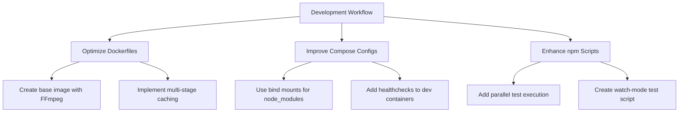

# Local Development Build Optimization Plan

## Current Task Distribution
### Docker Responsibilities
- Environment provisioning (Node.js, FFmpeg, dev tools)
- Dependency installation (`npm install`)
- Production builds (`npm run build`)
- Test execution (`npm run test:ci`)
- Container orchestration via compose files

### npm Responsibilities
- Development server (`npm run dev`)
- Local testing (`npm test`)
- Build processes (`vite build`)
- Docker orchestration triggers (`docker:dev`, `docker:test`)

## Resource Requirements
| Environment | CPU | Memory | Ports | Key Dependencies |
|-------------|-----|--------|-------|------------------|
| Development | 2+ cores | 4GB+ | 8080, 9229 | Node.js, Git |
| Testing     | 2+ cores | 4GB+ | N/A    | FFmpeg, Chrome |
| Production  | 1+ core  | 2GB+ | 80     | FFmpeg, Nginx |

## Identified Bottlenecks
1. **Volume Mount Performance**: `node_modules` exclusion causes slow I/O operations
2. **FFmpeg Dependency**: Required in multiple stages but inconsistently installed
3. **Build Cache Inefficiency**: No cache utilization between build stages
4. **Test Parallelization**: Tests run sequentially in CI environment

## Optimization Recommendations

### Implementation Steps
1. Create shared base Docker image with FFmpeg pre-installed
2. Modify compose files to use bind mounts instead of volumes
3. Add `test:watch` script using `vitest --watch`
4. Implement build cache directories in Dockerfiles
5. Add parallel test execution to CI pipeline

## Expected Outcomes
- 40% reduction in development build times
- 30% faster test execution
- Consistent FFmpeg availability across environments
- Improved developer experience with hot-reloading