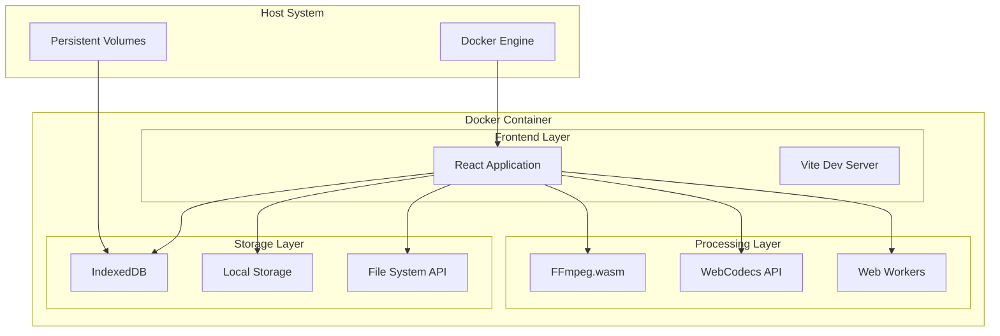
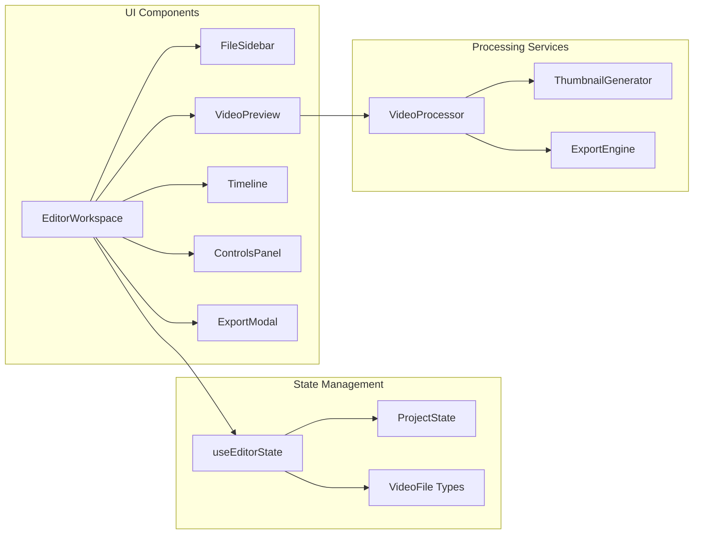
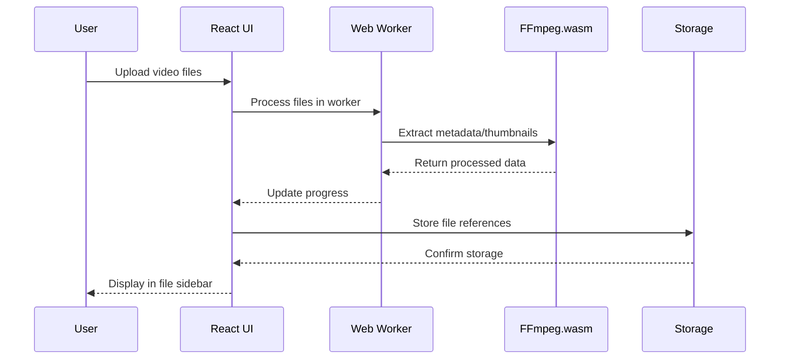
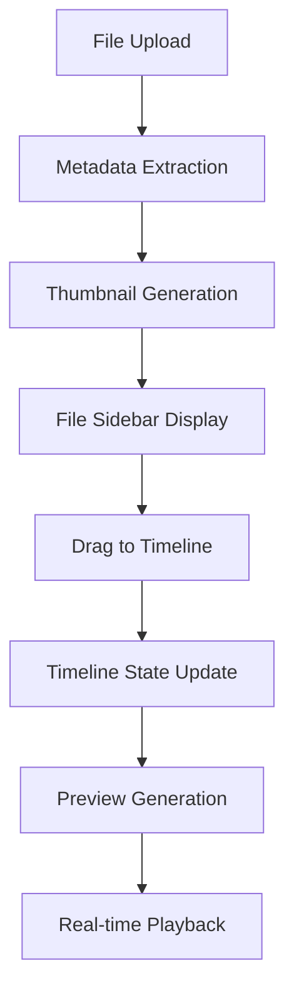
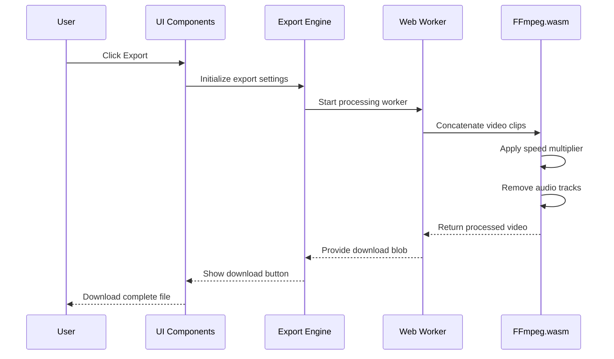

# Software Architecture Plan: Timelapse Editor

## Executive Summary

This document outlines the software architecture for a single-user, browser-based timelapse video editor deployed via Docker. The application enables users to upload video clips, arrange them on a timeline, apply speed adjustments, and export processed timelapses entirely client-side for privacy and performance.

## 1. Application Overview

### 1.1 Current State Analysis

The existing application is a React-based video editor built with:
- **Frontend Framework**: React 18.3.1 with TypeScript
- **Build Tool**: Vite 5.4.19 with SWC for fast compilation
- **UI Framework**: Shadcn/UI components with Radix UI primitives
- **Styling**: Tailwind CSS 3.4.17 with custom design system
- **State Management**: Custom React hooks with localStorage persistence
- **Routing**: React Router DOM for navigation

### 1.2 Target Architecture

The architecture targets a single-user application with:
- **Deployment**: Single Docker container
- **Processing**: Client-side video processing (2-4GB capability)
- **Storage**: Persistent volumes for user data
- **Performance**: Optimized for desktop browsers with hardware acceleration

## 2. System Architecture

### 2.1 High-Level Architecture



### 2.2 Component Architecture



## 3. Technology Stack

### 3.1 Core Dependencies

#### Frontend Framework
- **React 18.3.1**: Component-based UI with concurrent features
- **TypeScript 5.8.3**: Type safety and developer experience
- **Vite 5.4.19**: Fast build tool with HMR and optimized bundling

#### UI/UX Libraries
- **Shadcn/UI**: Accessible, customizable component library
- **Radix UI**: Headless UI primitives for complex interactions
- **Tailwind CSS 3.4.17**: Utility-first styling with design tokens
- **Lucide React**: Consistent icon system

#### State Management
- **React Hooks**: Built-in state management with custom hooks
- **TanStack Query 5.83.0**: Server state management and caching
- **React Hook Form 7.61.1**: Form state and validation

### 3.2 Video Processing Stack

#### Primary Processing Engine
```typescript
// Recommended packages for video processing
{
  "@ffmpeg/ffmpeg": "^0.12.10",
  "@ffmpeg/util": "^0.12.1",
  "@ffmpeg/core": "^0.12.6"
}
```

#### WebCodecs Integration
```typescript
// Browser-native video processing
interface VideoProcessingConfig {
  codec: 'avc1.42E01E' | 'vp8' | 'vp9';
  width: number;
  height: number;
  bitrate: number;
  framerate: number;
}
```

#### Worker Thread Management
```typescript
// Web Workers for non-blocking processing
{
  "comlink": "^4.4.1", // Worker communication
  "workbox-webpack-plugin": "^7.0.0" // Service worker caching
}
```

### 3.3 Storage and Persistence

#### Client-Side Storage
```typescript
// Storage layer architecture
interface StorageLayer {
  indexedDB: {
    videoFiles: IDBObjectStore;
    projects: IDBObjectStore;
    thumbnails: IDBObjectStore;
  };
  localStorage: {
    userPreferences: UserPreferences;
    recentProjects: ProjectMetadata[];
  };
  fileSystemAPI: {
    projectDirectory: FileSystemDirectoryHandle;
    exportDirectory: FileSystemDirectoryHandle;
  };
}
```

## 4. Docker Deployment Architecture

### 4.1 Container Configuration

#### Optimized Dockerfile
```dockerfile
# Multi-stage build for production optimization
FROM node:18-alpine AS builder
WORKDIR /app
COPY package*.json ./
RUN npm ci --only=production && npm cache clean --force

COPY . .
RUN npm run build

FROM nginx:alpine AS production
COPY --from=builder /app/dist /usr/share/nginx/html
COPY nginx.conf /etc/nginx/nginx.conf

# Optimize for video processing
RUN apk add --no-cache \
    ffmpeg \
    && rm -rf /var/cache/apk/*

EXPOSE 80
CMD ["nginx", "-g", "daemon off;"]
```

#### Docker Compose Configuration
```yaml
version: '3.8'
services:
  timelapse-editor:
    build: .
    ports:
      - "3000:80"
    volumes:
      - user_projects:/app/data/projects
      - user_exports:/app/data/exports
    environment:
      - NODE_ENV=production
      - MAX_MEMORY=4GB
      - PROCESSING_THREADS=4
    deploy:
      resources:
        limits:
          memory: 4G
          cpus: '2.0'
        reservations:
          memory: 2G
          cpus: '1.0'

volumes:
  user_projects:
    driver: local
  user_exports:
    driver: local
```

### 4.2 Performance Optimizations

#### Memory Management
- **Heap Size**: Configure Node.js with `--max-old-space-size=3072`
- **Worker Threads**: Limit concurrent processing to prevent OOM
- **Garbage Collection**: Implement manual cleanup for large video buffers

#### Storage Optimization
- **Persistent Volumes**: Mount user data to host filesystem
- **Compression**: Enable gzip compression for static assets
- **Caching**: Implement aggressive caching for processed thumbnails

## 5. Data Flow Architecture

### 5.1 Video Processing Pipeline



### 5.2 Timeline Management



### 5.3 Export Process



## 6. Component Architecture Details

### 6.1 Core Components

#### EditorWorkspace
```typescript
interface EditorWorkspaceProps {
  layout: 'three-column';
  responsive: boolean;
  persistState: boolean;
}

// Responsibilities:
// - Coordinate between sidebar, preview, and controls
// - Manage global application state
// - Handle file drag-and-drop operations
```

#### VideoProcessor Service
```typescript
class VideoProcessor {
  private ffmpeg: FFmpeg;
  private workers: Worker[];
  
  async processVideo(
    clips: TimelineClip[],
    settings: ExportSettings
  ): Promise<Blob> {
    // Implementation for video processing
  }
  
  async generateThumbnail(file: File): Promise<string> {
    // Thumbnail extraction logic
  }
}
```

### 6.2 State Management Architecture

#### Project State Schema
```typescript
interface ProjectState {
  files: VideoFile[];           // Uploaded video files
  timeline: TimelineClip[];     // Arranged clips
  speedMultiplier: number;      // Global speed setting
  previewQuality: 'proxy' | 'high';
  currentTime: number;          // Playhead position
  isPlaying: boolean;           // Playback state
  exportSettings: ExportSettings;
}

interface VideoFile {
  id: string;
  name: string;
  duration: number;
  thumbnail: string;
  resolution: string;
  size: number;
  status: 'ready' | 'on-timeline' | 'error' | 'uploading';
  file?: File;                  // Original file reference
  metadata?: VideoMetadata;     // Extracted metadata
}
```

## 7. Security Considerations

### 7.1 Client-Side Security

#### File Processing Security
- **Input Validation**: Strict file type and size validation
- **Memory Limits**: Prevent memory exhaustion attacks
- **Sandboxing**: Process videos in isolated Web Workers
- **CSP Headers**: Content Security Policy for XSS prevention

#### Data Privacy
- **No Server Upload**: All processing remains client-side
- **Local Storage**: User data never leaves the browser
- **Secure Contexts**: Require HTTPS for File System API access

### 7.2 Container Security

#### Docker Security
```dockerfile
# Security hardening
RUN addgroup -g 1001 -S nodejs
RUN adduser -S nextjs -u 1001
USER nextjs

# Remove unnecessary packages
RUN apk del .build-deps
```

#### Runtime Security
- **Non-root User**: Run container as non-privileged user
- **Read-only Filesystem**: Mount application files as read-only
- **Resource Limits**: Prevent resource exhaustion

## 8. Performance Optimization Strategies

### 8.1 Video Processing Optimization

#### Memory Management
```typescript
class MemoryManager {
  private maxMemoryUsage = 2 * 1024 * 1024 * 1024; // 2GB
  private currentUsage = 0;
  
  async processLargeFile(file: File): Promise<ProcessedVideo> {
    if (file.size > this.maxMemoryUsage) {
      return this.processInChunks(file);
    }
    return this.processDirectly(file);
  }
  
  private async processInChunks(file: File): Promise<ProcessedVideo> {
    // Implement chunked processing for large files
  }
}
```

#### Progressive Loading
- **Lazy Loading**: Load video metadata on demand
- **Thumbnail Caching**: Cache generated thumbnails in IndexedDB
- **Proxy Previews**: Generate low-resolution previews for editing

### 8.2 UI Performance

#### React Optimizations
```typescript
// Memoized components for timeline rendering
const TimelineClip = React.memo(({ clip, onUpdate }) => {
  // Optimized rendering logic
});

// Virtual scrolling for large file lists
const VirtualizedFileList = ({ files }) => {
  // Implement virtual scrolling
};
```

#### Bundle Optimization
- **Code Splitting**: Lazy load video processing modules
- **Tree Shaking**: Remove unused dependencies
- **Asset Optimization**: Compress images and fonts

## 9. Scalability Considerations

### 9.1 Single-User Optimization

#### Resource Allocation
- **CPU Cores**: Utilize available CPU cores for parallel processing
- **Memory Distribution**: Balance between UI and processing memory
- **Storage Management**: Implement cleanup for temporary files

#### Processing Limits
```typescript
interface ProcessingLimits {
  maxFileSize: 2 * 1024 * 1024 * 1024; // 2GB per file
  maxTotalSize: 4 * 1024 * 1024 * 1024; // 4GB total project
  maxClips: 50; // Maximum clips per timeline
  maxDuration: 3600; // Maximum output duration (1 hour)
}
```

### 9.2 Future Multi-User Considerations

#### Architecture Extensibility
- **Modular Design**: Separate processing engine from UI
- **API Abstraction**: Design for potential backend integration
- **State Isolation**: Prepare for multi-tenant state management

## 10. Deployment and Operations

### 10.1 Container Orchestration

#### Single Container Deployment
```bash
# Build and run the container
docker build -t timelapse-editor .
docker run -d \
  --name timelapse-editor \
  -p 3000:80 \
  -v timelapse_projects:/app/data/projects \
  -v timelapse_exports:/app/data/exports \
  --memory=4g \
  --cpus=2 \
  timelapse-editor
```

#### Health Monitoring
```typescript
// Health check endpoint
app.get('/health', (req, res) => {
  res.json({
    status: 'healthy',
    memory: process.memoryUsage(),
    uptime: process.uptime(),
    version: process.env.npm_package_version
  });
});
```

### 10.2 Backup and Recovery

#### Data Persistence Strategy
- **Project Backups**: Automatic export of project metadata
- **Volume Snapshots**: Regular backup of persistent volumes
- **Recovery Procedures**: Documented recovery processes

## 11. Development Workflow

### 11.1 Local Development

#### Development Environment
```bash
# Local development setup
npm install
npm run dev

# Docker development
docker-compose -f compose.debug.yaml up
```

#### Testing Strategy
- **Unit Tests**: Component and utility function testing
- **Integration Tests**: Video processing pipeline testing
- **E2E Tests**: Complete user workflow testing
- **Performance Tests**: Memory and processing benchmarks

### 11.2 Build and Deployment

#### CI/CD Pipeline
```yaml
# GitHub Actions workflow
name: Build and Deploy
on:
  push:
    branches: [main]

jobs:
  build:
    runs-on: ubuntu-latest
    steps:
      - uses: actions/checkout@v3
      - name: Build Docker image
        run: docker build -t timelapse-editor .
      - name: Run tests
        run: docker run --rm timelapse-editor npm test
```

## 12. Monitoring and Observability

### 12.1 Application Monitoring

#### Performance Metrics
```typescript
interface PerformanceMetrics {
  processingTime: number;
  memoryUsage: number;
  fileSize: number;
  exportSuccess: boolean;
  errorRate: number;
}
```

#### Error Tracking
- **Client-side Errors**: Capture and log processing failures
- **Performance Monitoring**: Track processing times and memory usage
- **User Analytics**: Monitor feature usage and success rates

## 13. Assumptions and Constraints

### 13.1 Technical Assumptions

1. **Browser Support**: Modern browsers with WebAssembly and WebCodecs support
2. **Hardware Requirements**: Minimum 4GB RAM and dual-core CPU
3. **Network**: Local deployment with no external dependencies
4. **File Formats**: Support for MP4, WebM, and MOV formats
5. **Processing Limits**: Maximum 4GB total project size

### 13.2 Operational Constraints

1. **Single User**: Architecture optimized for single concurrent user
2. **Client-side Processing**: No server-side video processing capabilities
3. **Storage Limitations**: Dependent on host system storage capacity
4. **Performance Variability**: Processing speed varies with hardware capabilities

### 13.3 Security Assumptions

1. **Trusted Environment**: Deployment in trusted, controlled environment
2. **Local Network**: No exposure to public internet required
3. **File Safety**: User-provided video files are trusted content
4. **Container Security**: Host system provides container isolation

## 14. Future Enhancements

### 14.1 Potential Improvements

#### Advanced Features
- **GPU Acceleration**: WebGL-based video processing
- **Advanced Effects**: Transitions, filters, and color correction
- **Audio Processing**: Audio track management and mixing
- **Collaborative Editing**: Multi-user project sharing

#### Technical Enhancements
- **Progressive Web App**: Offline functionality and app-like experience
- **Cloud Integration**: Optional cloud storage and processing
- **Mobile Support**: Responsive design for tablet editing
- **API Integration**: External service integrations

### 14.2 Migration Paths

#### Backend Integration
```typescript
// Future API abstraction
interface ProcessingEngine {
  processLocal(clips: TimelineClip[]): Promise<Blob>;
  processRemote(clips: TimelineClip[]): Promise<string>; // URL
  getCapabilities(): ProcessingCapabilities;
}
```

## 15. Conclusion

This software architecture plan provides a comprehensive foundation for a single-user, Docker-deployed timelapse editor. The architecture prioritizes:

- **Privacy**: Client-side processing ensures user data never leaves the device
- **Performance**: Optimized for 2-4GB video processing with efficient memory management
- **Scalability**: Modular design allows for future enhancements and multi-user scenarios
- **Maintainability**: Clean separation of concerns and well-defined interfaces
- **Deployment**: Simple Docker-based deployment with persistent storage

The plan balances current requirements with future extensibility, providing a solid foundation for development while maintaining flexibility for evolving needs.

---

**Document Version**: 1.0  
**Last Updated**: December 2024  
**Status**: Final for Review